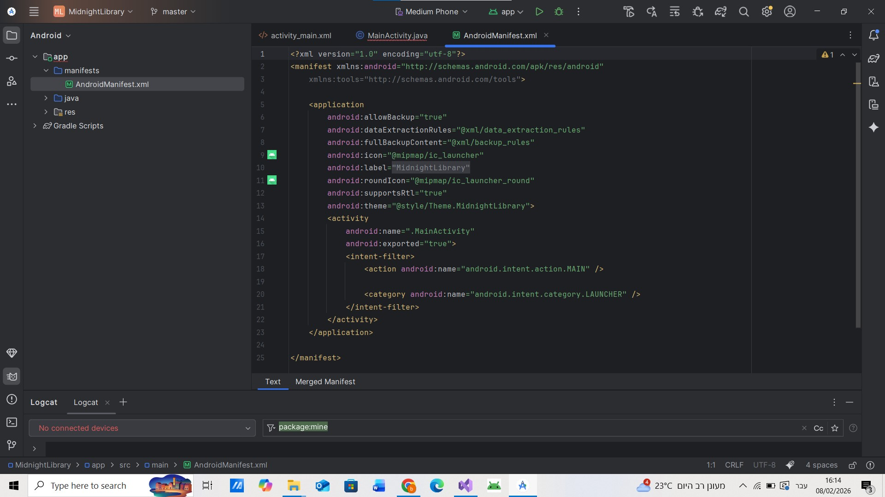
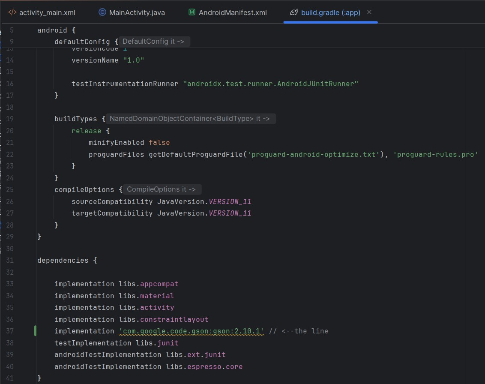
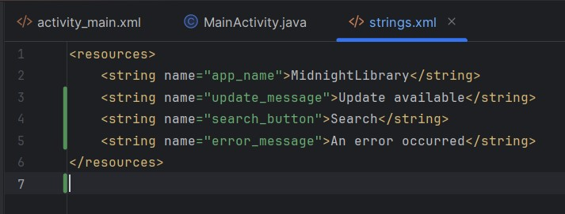
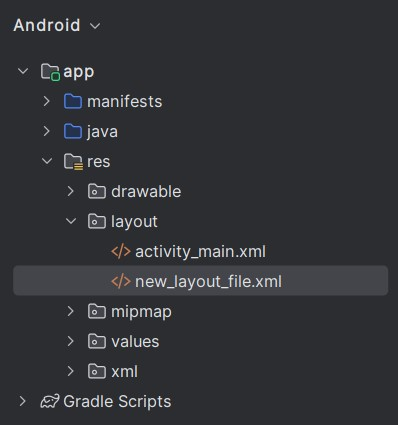

# חקר Android Studio - תשובות התלמיד

**שם התלמיד:** בת אל חייפץ
**תאריך:** 27_02_2026

---

## חלק א' - סיור ב-Android Studio (30 נקודות)

### שאלה 1: תיקיות ראשיות (10 נקודות)
צלם screenshot של חלון הProject (תצוגת Android) והדבק כאן:


רשום את שמות 3 התיקיות הראשיות שאתה רואה:

1. manifests  
2. java  
3. res  

---

### שאלה 2: AndroidManifest.xml (10 נקודות)
צלם screenshot של קובץ AndroidManifest.xml והדבק כאן:



**מה התפקיד של קובץ זה? (2-3 משפטים)**

הקובץ הזה הוא קובץ ההגדרות הראשי של אפליקציית אנדרואיד.
הוא מסביר למערכת ההפעלה מה יש באפליקציה ואיך להפעיל אותה.

בקובץ מציינים למשל אילו מסכים יש באפליקציה, איזה מסך נפתח ראשון, ואילו הרשאות האפליקציה צריכה (כמו גישה לאינטרנט או למצלמה).
המערכת קוראת את הקובץ הזה לפני שהאפליקציה פועלת כדי לדעת איך לעבוד איתה בצורה תקינה.

---

### שאלה 3: תיקיית res (10 נקודות)
צלם screenshot של תוכן תיקיית res והדבק כאן:


**רשום 3 תיקיות משנה שנמצאות בתוך res:**

1. drawable
2. layout
3. xml

**מה נמצא בכל אחת מהתיקיות האלה?**

drawable -
בתיקייה זו נמצאים קבצי תמונות וגרפיקה של האפליקציה, כמו אייקונים, רקעים וכפתורים מעוצבים, וגם קבצי עיצוב גרפיים.
layout –
בתיקייה זו נמצאים קבצים שמגדירים את מבנה המסכים באפליקציה – כלומר איפה ממוקמים הכפתורים, הטקסטים, התמונות ושאר הרכיבים במסך.
xml –
בתיקייה זו נמצאים קבצי הגדרות שונים של האפליקציה, כמו הגדרות ניווט או קבצי תצורה מיוחדים.

---

## חלק ב' - עבודה עם Gradle (40 נקודות)

### שאלה 4: build.gradle (Module) (15 נקודות)
צלם screenshot של build.gradle (Module: app) אחרי שהוספת את Gson:



**איזו שורה הוספת בדיוק?**

```gradle
implementation 'com.google.code.gson:gson:2.10.1'
```

---

### שאלה 5: מה זה Gson? (15 נקודות)

ג׳יסון היא ספרייה שמאפשרת להמיר נתונים שמגיעים מהאינטרנט לאובייקטים בשפת ג׳אווה, וגם להמיר אובייקטים בחזרה לפורמט נתונים שניתן לשלוח לשרת.
היא עוזרת לעבוד עם מידע בצורה מסודרת ופשוטה, במיוחד כאשר האפליקציה מתקשרת עם שרת ומקבלת נתונים להצגה במסך.


**תן דוגמה: מתי תשתמש ב-Gson באפליקציה אמיתית? (למשל באפליקציות כמו WhatsApp או Instagram)**

באפליקציית הודעות, כאשר מתקבלות הודעות מהשרת, המידע מגיע כנתונים מהאינטרנט.
הספרייה ממירה את הנתונים האלה לאובייקטים בג׳אווה כדי שהאפליקציה תוכל להציג את ההודעות על המסך בצורה מסודרת.

גם באפליקציית רשת חברתית, כאשר נטענים פוסטים או פרופילים של משתמשים, משתמשים בספרייה כדי להמיר את הנתונים שמגיעים מהשרת לאובייקטים שניתן לעבוד איתם בקוד ולהציג אותם למשתמש.

---

### שאלה 6: Gradle Sync (10 נקודות)

**מה קורה כשלוחצים על "Sync Now"?**

כאשר לוחצים על סנכרון, המערכת מעדכנת את הפרויקט לפי השינויים שבוצעו בקובץ ההגדרות.
היא מורידה את הספריות החדשות שהוספנו ומכינה את הפרויקט כך שניתן יהיה להשתמש בהן בקוד בלי שגיאות.


**מה יקרה אם לא נלחץ על Sync Now אחרי שהוספנו dependency?**

אם לא נבצע סנכרון אחרי שהוספנו ספרייה, המערכת לא תוריד אותה בפועל לפרויקט.
כתוצאה מכך, הקוד שינסה להשתמש בה יציג שגיאות, כי הפרויקט לא יזהה את הספרייה החדשה.

---

## חלק ג' - ארגון קבצים (30 נקודות)

### שאלה 7: strings.xml (10 נקודות)

**צלם screenshot של קובץ strings.xml שלך (עם לפחות 3 strings):**



**רשום את 3 ה-strings שהוספת:**

1. app_name
2. update_message
3. search_button

---

### שאלה 8: Layout File חדש (10 נקודות)

**איך יצרת layout file חדש? תאר את התהליך צעד אחר צעד:**

1. לחצתי על תיקיית העיצוב בתיקיית המשאבים.
2. בחרתי בתפריט ליצור קובץ עיצוב חדש.
3. נתתי שם לקובץ ובחרתי סוג קובץ עיצוב (לדוגמה מסך רגיל או תבנית).
4. לחצתי אישור, והקובץ נוצר והופיע בתיקיית העיצוב.

**צלם screenshot של ה-layout החדש:**



---

### שאלה 9: הבנה כללית (10 נקודות)

**מה ההבדל בין build.gradle (Project) ל-build.gradle (Module)?**

קובץ ההגדרות של הפרויקט מכיל הגדרות כלליות של כל הפרויקט, כגון מאגרי ספריות וכללי עבודה משותפים לכל חלקי הפרויקט.
קובץ ההגדרות של המודול מגדיר הגדרות ספציפיות ליישום עצמו, כמו אילו ספריות ישמשו בו, גרסת מערכת ההפעלה המינימלית והמסך הראשי.


**למה חשוב להפריד בין קוד (java/) לבין משאבים (res/)?**
הקוד מכיל את ההוראות והלוגיקה של היישום, ואילו המשאבים מכילים את כל מה שהיישום מציג למשתמש, כמו טקסטים, צבעים, תמונות ועיצובים.
הפרדה זו מסייעת בארגון, מקלה על תיקון ושינוי דברים מבלי להשפיע על החלקים האחרים, ומשפרת את קריאות הקוד והיישום.

---

## שאלות בונוס (10 נקודות נוספים)

### בונוס 1: (5 נקודות)
**מצא ותעד dependency נוסף שלא דיברנו עליו בשיעור. מה הוא עושה?**

**Dependency:**
```gradle
 implementation 'com.squareup.retrofit2:retrofit:2.9.0'
```

**מה הוא עושה:**
ספרייה שמאפשרת לשלוח ולקבל מידע מהאינטרנט בצורה מסודרת, למשל לשלוח בקשות לשרתים ולקבל תשובות. 


---

### בונוס 2: (5 נקודות)
**מה ההבדל בין minSdk ל-targetSdk ב-build.gradle?**

גרסת המערכת המינימלית היא הגרסה הנמוכה ביותר שעליה האפליקציה יכולה לפעול.

גרסת היעד היא הגרסה שהיישום מותאם אליה בצורה מלאה, וממנה נוצרת ההתנהגות המלאה של היישום לפי מערכת ההפעלה.


---

## סיכום אישי

**מה למדת היום שהכי עזר לך להבין את Android Studio?**

הבנתי איך כל התיקיות והקבצים בפרויקט קשורים זה לזה, ואיך המערכת מנהלת את הקבצים והמשאבים בצורה מסודרת.


**מה היה הכי מאתגר?**

להבין את הקשר בין קובצי ההגדרות לבין הקוד והמשאבים, במיוחד את נושא הספריות והסנכרון אחרי הוספתן.

---

**סיימתי את המשימה! ✅**

**זמן שלקח לי:** העבודה הייתה פרוסה על כמה ימים אז אני לא יודעת בדיוק אני מתארת לעצמי משהו כמו שעתיים- שעתיים וחצי...
